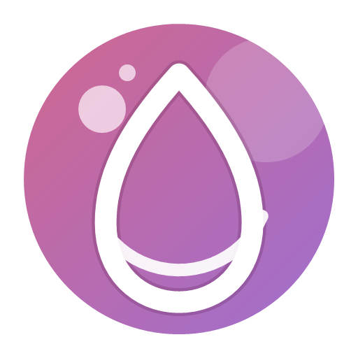

  

# EDcycle

**Français** | [English](#english)

---

## Français

EDcycle est une application de suivi du cycle menstruel, de la pilule et des symptômes liés à l'endométriose, disponible sur Windows, Linux, macOS et Android.

### Fonctionnalités

- Suivi des règles et du cycle avec calendrier mensuel
- Prévision des prochaines règles et de la fenêtre d'ovulation
- Suivi de la pilule (contraceptive, hormonale, endométriose) avec plaquette visuelle
- Journal de symptômes détaillé : douleur, flux, humeur, fatigue, impact quotidien
- Suivi spécifique endométriose (zones de douleur, symptômes digestifs, urinaires, intimes)
- Statistiques : durée moyenne des cycles, régularité, symptômes fréquents
- Export résumé médecin (texte) et sauvegarde JSON
- Profils locaux (sans compte) ou compte e-d synchronisé
- Interface adaptée bureau et mobile

### Plateformes

| Plateforme | Format |
|------------|--------|
| Windows | `.exe` (installeur NSIS) |
| Linux | `.tar.gz` |
| macOS | `.dmg` |
| Android | `.apk` |

### Installation

Télécharge la dernière version depuis les [releases GitHub](https://github.com/3yezz/cycle-download/releases).

### Stack technique

- **Interface** : React 18
- **Bureau** : Electron
- **Mobile** : Android natif (WebView)
- **Build** : electron-builder, Gradle

---

## English

EDcycle is a menstrual cycle, pill and endometriosis symptom tracking app available on Windows, Linux, macOS and Android.

### Features

- Period and cycle tracking with monthly calendar
- Next period and ovulation window prediction
- Pill tracking (contraceptive, hormonal, endometriosis) with visual blister pack
- Detailed symptom journal: pain, flow, mood, fatigue, daily impact
- Endometriosis-specific tracking (pain areas, digestive, urinary and intimate symptoms)
- Statistics: average cycle length, regularity, most frequent symptoms
- Medical summary export (text) and JSON backup
- Local profiles (no account required) or synced e-d account
- Responsive interface for desktop and mobile

### Platforms

| Platform | Format |
|----------|--------|
| Windows | `.exe` (NSIS installer) |
| Linux | `.tar.gz` |
| macOS | `.dmg` |
| Android | `.apk` |

### Installation

Download the latest version from the [GitHub releases](https://github.com/3yezz/cycle-download/releases).

### Tech stack

- **UI** : React 18
- **Desktop** : Electron
- **Mobile** : Android native (WebView)
- **Build** : electron-builder, Gradle
